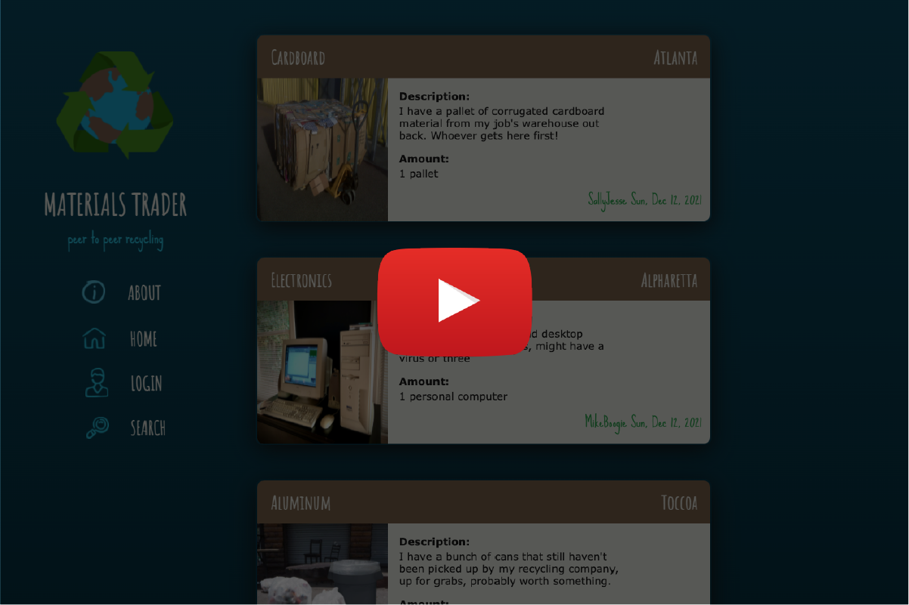

# materials-trader
♻️ ♻️ ♻️ ♻️ ♻️ ♻️

<br />

## Table of Contents

- [Description](#description)
- [User Story](#user-story)
- [Demo](#demo)
- [Installation](#installation)
- [Deployment](#deployment)
- [License](#license)
- [Criteria](#criteria)
- [Collaboration](#collaboration)

<br />

## Description

Welcome to Materials Trader! An emerging peer-to-peer bulk recycling network, facilitating the exchange of waste materials between all sustainably conscious consumers and businesses. Create your account today, and start posting materials to a network of interested parties. Choose from paper, plastic, glass, aluminum, all the way to textiles, electronics, batteries, and appliances. Post a photo description and approximation of amount, size or weight, along with contact and pickup location details of your preference. Of course, you can also search by material, and conveniently edit or delete your posts. Let’s get to work, getting materials into the right hands, for those that care about actually recycling a world of products deemed recyclable.

<br />
<br />

## User Story

```
As an environmentally conscious individual or business,
I want to ensure my recyclable waste actually gets recycled,
So that waste management infrastructure is alleviated.
```

<br />
<br />

## Demo

[](https://youtu.be/rTlkAiMGiAM/)


<br />
<br />


## Installation

:arrow_down:

Must first launch mySQL server with the following commands:

```
mysql -u root
source db/schema.sql
quit

```

Application will then run in the command-line with:
```
node seeds
node server
```

<br />
<br />

## Deployment

**Visit Materials Trader on Heroku:**

[](https://materials-trader.herokuapp.com/)

<br />

**Employing the following technology:**

[](https://www.npmjs.com/package/nodejs-mvc) [](https://www.npmjs.com/package/express-handlebars) [](https://www.npmjs.com/package/mysql2)

[](https://www.npmjs.com/package/sequelize) [](https://www.npmjs.com/package/connect-session-sequelize) [](https://www.npmjs.com/package/express-session)

[](https://www.npmjs.com/package/dotenv) [](https://www.npmjs.com/package/bcrypt)

<br />
<br />

## License

[](https://choosealicense.com/licenses/isc/)

<br />
<br />

## Criteria

```
When visiting the site for the first time, the user is presented with
a homepage, including any existing materials listings.

Home page listings display material type, pickup city, item thumbnail,
description, amount, listing user and date.

Navigation links include about, home, login/profile, and search.

When clicking login, the user is given the option to login or sign-up.

When choosing to sign-up, the user is prompted to provide an email address, create a username and password.

New user credentials are saved, and returning users must re-enter user
name and password.

After logging in, the profile page will include an option to logout.

When clicking on any listing, the user is presented with all details 
including on the home page, but includes contact details and map for 
pickup location.

From the profile, the user is presented with any listings they've
created, and the option to quickly delete or list more recyclables.

When selecting to list recyclalbes, the user is prompted to select
material from dropdown options, upload photo from camera roll, while 
completing input fields for description, amount, location, and 
preferred contact method.

When clicking on the list recyclables button, the new post is saved and 
the user is taken back to their updated profile.

When clicking on any existing listing from the profile or homepage, user has option to update or delete their listing.

If user is idol for a set time, user is still able to view the homepage,
but must login again before being able to add, update, or delete listings.

When opting to logout, the user is signed out of the site.
```

<br />
<br />

## Collaboration

Chris Champness  email:champnesschris@gmail.com   
<a href= "https://github.com/CChampness"></a>  


Mariya Harizanova  email:mharizanova@yahoo.com  
<a href= "https://github.com/mharizanova8703"></a>  


Olsen Ogouchi   email:chrisolen1993@gmail.com  
<a href= "https://github.com/Chrisolsen1993"></a>  


<br />
<br />


Thanks for taking a look!  

💚


